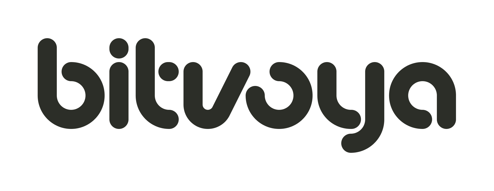
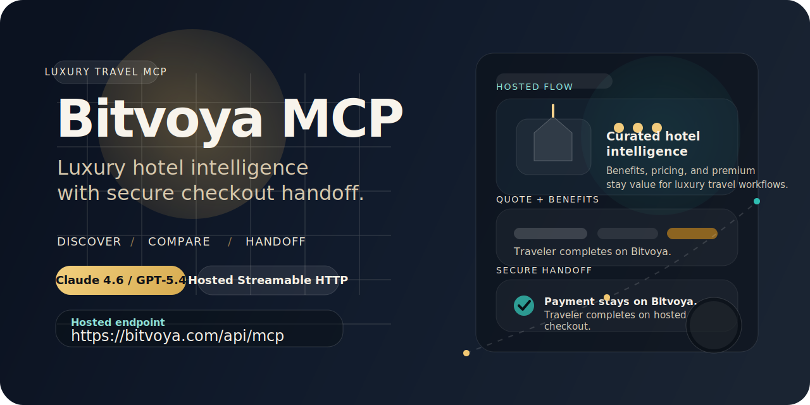

<p align="center">
  
</p>

<p align="center">
  
</p>

<p align="center">
  <a href="LICENSE"></a>
  
  
  
</p>

<p align="center">
  <strong>Luxury hotel intelligence and secure checkout handoff for AI travel agents.</strong>
</p>

<p align="center">
  Hosted public MCP for premium hotel discovery, benefit-rich rate comparison, quote preparation, and Bitvoya-controlled checkout completion.
</p>

<p align="center">
  <a href="#quick-start"><strong>Quick Start</strong></a>
  ·
  <a href="docs/public/CLIENT_SETUP.md"><strong>Client Setup</strong></a>
  ·
  <a href="docs/public/SECURITY_MODEL.md"><strong>Security Model</strong></a>
  ·
  <a href="docs/public/SECURE_HANDOFF.md"><strong>Secure Handoff</strong></a>
  ·
  <a href="server.json"><strong>server.json</strong></a>
</p>

> Public users connect to the hosted endpoint `https://bitvoya.com/api/mcp` with a Bitvoya-issued agent key from `Dashboard -> Connect Agent`. No self-hosting is required for normal usage.

## Why Bitvoya MCP

Bitvoya is not a generic hotel feed wrapped in MCP. It is designed around luxury booking value and the handoff boundary real travel agents actually need.

| What Bitvoya does well | Why it matters for agents |
| --- | --- |
| Luxury-first hotel coverage | Better fit for high-end trip planning, concierge, and member travel flows |
| Structured benefits and promotions | Agents can explain breakfast, upgrade eligibility, late checkout, and property credits without scraping prose |
| Explicit pricing semantics | `supplier_total_cny`, `service_fee_cny`, and `display_total_cny` stay distinct |
| Secure checkout handoff | Card entry and payment stay on Bitvoya-owned surfaces instead of agent chat |
| Remote hosted MCP | Users connect directly over Streamable HTTP with bearer auth |

## Built For

- AI travel assistants
- concierge and itinerary agents
- premium membership travel copilots
- Bitvoya-connected partner agents
- workflows that care about stay quality, perks, and real booking value

## Quick Start

### 1. Create an agent key

1. Sign in to `https://bitvoya.com`
2. Open `Dashboard -> Connect Agent`
3. Create a named agent connection

Direct page:

- `https://bitvoya.com/dashboard/agent-keys`

### 2. Connect the hosted MCP

Use the hosted endpoint:

- `https://bitvoya.com/api/mcp`

Add this header:

- `Authorization: Bearer <your_agent_key>`

Minimal remote MCP configuration:

```json
{
  "type": "streamable_http",
  "url": "https://bitvoya.com/api/mcp",
  "headers": {
    "Authorization": "Bearer <your_agent_key>"
  }
}
```

If you are testing manually outside an MCP client, also send:

- `Accept: application/json, text/event-stream`

### 3. Start with a tool-driven travel prompt

Examples:

- `Search luxury hotels in Tokyo for next weekend and compare the best options.`
- `Find five-star hotels in Paris with breakfast and explain which rate has the best value.`
- `Prepare a booking quote for the strongest Shangri-La option in Singapore.`

## Recommended Models

Bitvoya works best when the driving model is strong at tool selection, stateful booking flows, and not hallucinating hotel details from prior knowledge.

- prefer `Claude 4.6`, `GPT-5.4`, or comparable flagship reasoning models
- these models follow quote, intent, and state-polling steps more reliably
- smaller models can connect, but they are more likely to skip tools or blur pricing semantics

## Supported Client Setups

Client-specific setup guides are in [docs/public/CLIENT_SETUP.md](docs/public/CLIENT_SETUP.md).

| Client | Remote MCP | Notes |
| --- | --- | --- |
| Cherry Studio | Yes | Use the wrapped import shape plus manual `Authorization` header entry |
| Cursor | Yes | Works with `mcp.json` and environment-backed bearer auth |
| Windsurf | Yes | Remote Streamable HTTP with custom headers |
| Claude Code | Yes | Use `claude mcp add --transport http` |
| GitHub Copilot CLI | Yes | Configure as remote HTTP MCP |
| Goose | Yes | Use the remote MCP endpoint and bearer header |

## What Agents Can Do

Bitvoya MCP is designed for discovery, comparison, quote preparation, and secure completion handoff.

| Workflow | Primary tools |
| --- | --- |
| City and hotel discovery | `search_hotels`, `compare_hotels` |
| Hotel detail and room/rate exploration | `get_hotel_detail`, `get_hotel_rooms`, `compare_rates` |
| Quote preparation | `prepare_booking_quote` |
| Booking intent creation | `create_booking_intent` |
| Order and handoff state polling | `get_booking_state` |

## Luxury Value Edge

Bitvoya is strongest when the traveler cares about premium stay value instead of just the lowest visible headline rate.

- participating rates can surface breakfast, upgrade paths, early check-in, late checkout, and hotel credit such as `USD 100` property credit
- long-stay promotions such as `stay 3 pay 2` and `stay 4 pay 3` can materially change effective value
- benefits and promotions are returned in structured output, so the agent can compare real booking quality instead of guessing from marketing copy

Benefit availability still depends on hotel, rate, market, and stay dates. Returned hotel and rate payloads should always be treated as the source of truth.

## Booking Journey

Bitvoya intentionally keeps sensitive execution on Bitvoya-hosted surfaces.

1. The agent discovers hotels, rooms, and rates.
2. The agent prepares a booking quote and creates a booking intent.
3. The traveler is handed to a Bitvoya-hosted secure checkout surface.
4. The agent continues polling state with `get_booking_state`.

Public agents do not directly own:

- raw card entry
- payment execution
- final supplier-facing booking submission

That boundary is deliberate. It keeps the public MCP useful without pushing payment risk or card handling into third-party chat tools.

## Price Fields

Agents should present pricing carefully.

- search-stage output may include `supplier_min_price_cny` as indicative discovery pricing
- final room and rate evaluation comes from `get_hotel_rooms`
- `get_hotel_rooms` returns:
  - `supplier_total_cny`
  - `service_fee_cny`
  - `display_total_cny`
- `display_total_cny` is the guest-facing total aligned with current Bitvoya product behavior

## Docs Hub

- client setup: [docs/public/CLIENT_SETUP.md](docs/public/CLIENT_SETUP.md)
- FAQ: [docs/public/FAQ.md](docs/public/FAQ.md)
- security model: [docs/public/SECURITY_MODEL.md](docs/public/SECURITY_MODEL.md)
- secure handoff design: [docs/public/SECURE_HANDOFF.md](docs/public/SECURE_HANDOFF.md)
- release notes: [docs/public/releases/v0.2.0.md](docs/public/releases/v0.2.0.md)
- registry metadata: [server.json](server.json)
- maintainer setup: [DEVELOPMENT.md](DEVELOPMENT.md)

## License

This repository is licensed under `Apache-2.0`. See [LICENSE](LICENSE) and [NOTICE](NOTICE).

The open-source license covers this repository's code and docs. It does not grant access to:

- Bitvoya hosted production infrastructure
- live hotel inventory and partner data feeds
- Bitvoya-issued agent keys or user accounts
- Bitvoya trademarks, brand assets, or service access outside normal product terms

## Important Notes

- Bitvoya calls this flow `Connect Agent`
- the generated credential is a revocable agent key
- website login credentials and MCP credentials are intentionally different
- multiple agent keys under one Bitvoya user still map to the same Bitvoya account history
- normal users connect to the hosted MCP and do not need direct database or server configuration
